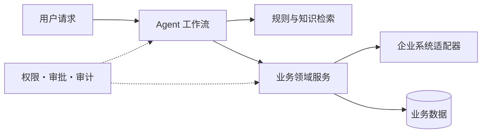

# Oria 架构概览

Oria 是一个面向招商活动的 AI Agent 编排平台。它将模型的理解与生成能力，和确定性的业务规则、权限审批、幂等执行及审计证据分层实现。

核心分层：

- Agent 工作流：负责任务编排、中断恢复和人工审批。
- 知识与规则：负责检索、版本化快照和可回查引用。
- 业务领域：负责资格过滤、活动状态、报名、选品和投放等确定性逻辑。
- 适配与存储：统一模型、向量检索、数据库及外部系统的交互边界。
- 治理机制：贯穿权限校验、职责分离、执行账本、审计事件和故障对账。

当前开源仓库重点展示本地 Community 场景和可复现的测试证据。真实企业系统适配和多 worker 生产语义不在当前已验证范围内。
