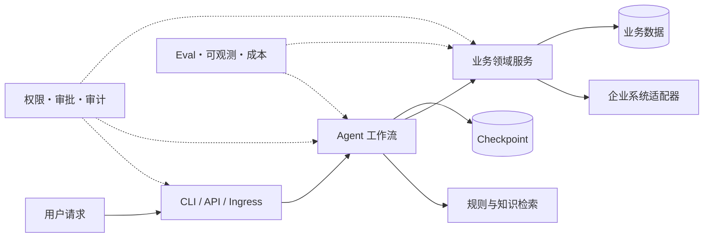

# Oria 架构概览

Oria 是面向招商活动编排的企业级 AI Agent 平台。它把模型擅长的理解、检索、排序和解释，与确定性的业务规则、权限审批、幂等执行和审计证据分层实现。



## 项目定位

Oria 同时展示两类 Agent 工程问题：步骤已知、需要跨天恢复的业务 Workflow，以及路径未知、随证据动态展开的 Agent loop。执行层统一使用 LangGraph，领域逻辑、适配层、评测集和集成代码由 Oria 实现；Checkpoint、MCP 等协议与基础设施复用成熟实现。

项目按永久纵向切片演进：早期版本建立的 Context、Protocol、Graph、Repository 和测试骨架会被后续版本扩展，不为演示另建一次性流程。

### Hero 场景 A：招商活动全流程

场景 A 是步骤预定、含人工审批与外部等待的 Workflow：

1. 接收并规范化招商需求。
2. 检索规则，形成带逐字段引用的不可变 `CampaignRuleSnapshot`。
3. 由 `EligibilityPolicy` 确定性预筛商家。
4. LLM 仅在候选集内做软条件排序，生成活动、券批次与商家名单草案。
5. 运营审批 `LaunchPlan` 后，分别物化券批次并完成商家侧招商投放。
6. 汇聚商家自主报名与系统自动圈品，按规则执行动态业务确认链。
7. 将已确认报名商品与券批次建立可校验、可幂等的关联。
8. 异步提交招后选品，并等待受信事件返回选品结果。
9. 另一道审批通过后，仅将入选且券关联有效的商品投放到 C 端。
10. 通知商家并保存回执；通知失败进入重试或死信，不回滚投放。

V0.1 先交付其中的只读提案切片；V0.3 在同一 Graph 上补齐完整 10 步。商家侧招商投放、招后选品和 C 端投放是不同实体与事件，不能合并成一个模糊的“投放”动作。

### Hero 场景 B：动态归因

场景 B 面向“昨天华东餐饮招商转化率为什么下降”一类实时排查。Agent 根据每一步结果动态决定继续查漏斗、区域、活动、大盘还是历史经验，而不是执行预先固定的 DAG。

它复用同一个有界 `model → tools → validate` 研究子图，加入只读分析工具、evaluator-optimizer、证据链、预算终止和证据不足时的 abstain。根因标签与生产查询库物理隔离，冻结 holdout 用于防止标签泄漏和逐题调参。

## 分层架构

```text
接入层：CLI / Web / 飞书与钉钉 Webhook / API
    ↓
任务控制面：Durable Job / lease / retry / cancel / HITL / external wait
    ↓
Agent Runtime：Workflow / ReAct / Multi-Agent / Context / Memory
    ↓
能力层：LLM Provider / Tool / RAG / Domain Service / MCP
    ↓
数据平面：Checkpoint DB / Platform DB / Business DB / Vector / Object Store

横切：Policy / Guardrails / Secrets / Audit / OTel / Eval / Cost Budget
```

流程已知、跨天、需要持久化编排时使用 Workflow；探索性、实时、依赖中间发现时使用 Agent loop。两者共享 Checkpoint、HITL、工具协议和治理能力，不维护第二套执行循环。

## 模块职责

| 模块 | 主要职责 |
| --- | --- |
| `core/` | 进程级 `RuntimeServices`、每次执行 `Context`、Protocol、注册表、事件与中间件；隔离 actor、tenant 和 run 状态。 |
| `providers/` | 统一 LLM capability、错误、流式与结构化输出契约；承载 Mock、OpenAI-compatible 和 Anthropic 实现。 |
| `prompts/` | 管理显式版本的 Jinja Prompt 资产，保证历史调用与评测可复现。 |
| `agent/` | 提供有界 model/tool/validate 子图、动态工具选择、停止条件与 Planner。 |
| `orchestrator/` | 基于 LangGraph 组织预定 DAG、条件图、并行汇聚、Checkpoint、HITL 和恢复。 |
| `domain/` | 定义招商实体、状态机、资格策略、业务唯一键和事务不变量；所有业务写入在此校验。 |
| `tools/` | 注册和执行 Tool，校验 schema、allowlist、风险策略、幂等账本；连接内建能力与 MCP。 |
| `rag/` | 文档摄入、版本目录、授权检索、dense/BM25 混合召回、rerank 与引用校验。 |
| `storage/` | 实现 SQLAlchemy Repository、Checkpoint factory、向量库、缓存与对象存储生命周期。 |
| `permission/` | 提供唯一的 `PolicyDecision` 来源，覆盖 tenant、RBAC、ABAC、职责分离和 RAG ACL。 |
| `guardrails/` | 处理输入注入、RAG/Memory 投毒、输出敏感信息和工具执行前权限复核。 |
| `memory/` | 管理短期历史、滑窗摘要、事实账本和显式 opt-in 的跨会话记忆生命周期。 |
| `eval/` | 统一管理冻结数据集、确定性回归、真实模型评测、质量/成本/延迟指标与门禁。 |
| `obs/` | 传播关联 ID，记录结构化日志、Trace、Metrics、usage 和成本预算，不默认采集敏感正文。 |
| `adapters/` | 隔离外部 Provider、企业数据库、券、招商、选品、C 端投放和 IM 的实现差异。 |
| `ingress/` | 将 CLI、飞书、钉钉等输入规范化为受信主体和统一请求，负责验签、防重放与去重。 |
| `api/` | 提供认证授权、幂等提交、审批、Job 查询/取消和可续传 SSE。 |
| `jobs/` | 以数据库状态机承载长任务、worker lease、heartbeat、外部事件等待、重试和 Webhook。 |
| `web/` | 提供提交、执行轨迹、审批、取消和结果查看的企业工作台。 |

模块通过 `typing.Protocol` 与 Context 连接。业务层不直接依赖具体数据库或外部客户端；Factory 负责选择 Community 或 Production 实现。内部受信扩展走 entry-point 插件，不受信扩展必须隔离在独立进程或容器中并通过 MCP 接入。

## 核心设计不变量

这些约束是 Oria 的安全和可恢复性边界，不因 Provider、存储后端或部署形态变化而改变。

### 1. Determinism first

- `EligibilityPolicy` 与 `ProductEligibilityPolicy` 执行类目、区域、价格、关键词、黑白名单、状态等硬资格判定。
- LLM 只能在已授权、已通过硬资格的候选集内做软排序、草案和解释；输出候选必须是该集合的子集。
- LLM 不直接写数据库，不决定审批主体、最终选品结果或业务状态跳转。所有写入由确定性 Domain Service 重新校验后执行。
- 规则缺失、冲突或证据不足时进入未决项或 abstain，模型不能自行补默认值。

### 2. 幂等与唯一键

- Campaign、券批次、报名项、投放、通知等实体使用 tenant 范围内的业务唯一键；同一业务请求重复执行后，目标记录计数仍保持 `1`。
- 外部副作用使用规范化参数哈希、idempotency key、execution ledger、reservation 和 receipt；重试先读取历史结果。
- `unknown` 表示外部结果不确定，只能进入对账或经验证的补偿流程，不能盲目重投。
- Checkpoint 恢复可能重放节点，因此“节点再次运行”不能等价为“副作用再次发生”。

### 3. 事务与真相源边界

- 业务状态写入、execution ledger、Domain/Audit Event 与 outbox 在 Business DB 同一事务提交。
- Job/审批状态、Platform Audit Event 与 outbox 在 Platform DB 同一事务提交。
- 两库之间不伪造分布式事务，只通过稳定 ID、幂等消费、可重建投影和对账实现最终一致。
- 外部系统同样不属于本地事务；状态机、账本和回执负责收敛，不能宣称全链路原子。

### 4. Checkpoint 与恢复

- LangGraph 官方 Checkpointer 是“执行到哪里”的唯一恢复真相源，保存状态、channel version 和 pending writes。
- Domain Event 是业务事实，Audit Event 是安全审计事实；二者可用统一关联 ID 查询，但不能代替 Checkpoint。
- HITL 使用真实 LangGraph `interrupt()` 暂停，并以 `Command(resume=...)` 恢复，不用普通布尔字段模拟中断。
- 审批绑定 tenant、工具或计划、规范化参数哈希、checkpoint、policy version 和过期时间；恢复时重新鉴权，任一绑定变化都会使旧审批失效。
- 外部报名和选品事件先经过验签、去重和 wait/resource/version/checkpoint 绑定，再允许恢复 Graph。

### 5. 安全与权限

- PolicyEngine 是唯一鉴权来源，默认拒绝；所有查询强制 tenant/ACL，所有写操作在执行前按当前 actor 与 executor 身份重新鉴权。
- RBAC/ABAC 与职责分离共同约束操作：提交人不能自批高风险计划，两道高风险审批互不复用。
- 模型只看到当次获准的工具与最小必要数据。黑白名单原文、内部销售组织、密钥、完整 Prompt、隐式思维链和无必要 PII 不进入模型或普通日志。
- RAG、Memory、Tool 与 MCP 输出都按不可信数据处理，不能通过内容扩大工具 allowlist 或权限。
- 生产配置缺失时 fail closed；Mock、Fixture 或本地身份不能静默进入 Production profile。

### 6. 诚实验证口径

- Fixture 证明确定性控制流、契约和错误处理；Community 证明本地真实组件上的业务语义。
- 当前 Community 场景 A 使用 Mock 企业 Adapter 与合成数据。它不证明真实券、招商、商品库、选品、C 端投放或 IM 已接入。
- Live Provider 与 Enterprise Adapter 按 provider、模型、后端和环境分别出具验证卡；一个目标通过不能代表其他目标。
- Mock 录放、Fixture baseline 或本地 SQLite 结果不能被描述为真实模型质量、企业规模或多 worker 生产能力。

## 数据与恢复关系

| 数据 | 权威范围 | 主要用途 |
| --- | --- | --- |
| LangGraph Checkpoint | 执行恢复 | resume、pending writes、time travel |
| Business Domain Event | 业务事实 | 投影、回放、业务对账 |
| Platform/Business Audit Event | 安全审计 | 身份、授权、审批与副作用追踪 |
| 两库各自 Outbox | 本库待投递事件 | 保证源状态与事件在单库内一致 |
| 文档 Catalog + ObjectStore | 知识生命周期 | 版本、原文、删除与向量索引重建 |
| Chroma/Milvus | 可重建检索投影 | tenant/ACL pre-filter 后的向量召回 |

`tenant_id/session_id/thread_id/run_id/job_id/correlation_id` 贯穿 API、Job、Graph、LLM、Tool、Checkpoint、Event 和 Trace，用于关联不同真相源，而不是把它们合并成一张万能表。

## Community 与 Production

Community 默认使用 SQLite、官方 `AsyncSqliteSaver`、Chroma、本地 Embedder、内存缓存、本地对象目录、Console JSON 和 Mock 企业 Adapter。`demo` profile 零账号、零 Key、零外部服务可运行；`standard` profile 可使用用户自带 LLM Key 与本地真实组件。

Production 只允许 standard profile，并逐步切换到 PostgreSQL、Milvus、Redis、对象存储、OTel 和企业 Adapter。SQLite 到 PostgreSQL、Chroma 到 Milvus 都遵循“权威数据迁移或重建、影子验证、受控切换、可说明的回滚边界”，不能把空库建表称为存量迁移完成。

## 版本规划

| 版本 | 一句话概览 |
| --- | --- |
| V0.1 | 建立场景 A 只读提案纵向切片：规则快照、硬资格预筛、LLM 软排序、引用与零副作用 Demo。 |
| V0.2 | 补齐 Provider 契约、授权 RAG、混合检索、rerank、冻结评测集与 Live/Community 分层验证。 |
| V0.3 | 扩展为场景 A 完整 10 步 Workflow，加入双审批、双来源汇聚、异步恢复、幂等账本和对账。 |
| V0.4 | 构建场景 B 动态归因 Agent，以标签隔离、证据链、abstain 和冻结 holdout 验证未知路径分析。 |
| V0.5 | 加入上下文治理、可删除 Memory、完整 ABAC/Guardrails、Supervisor/Subagent 与单/多 Agent 公平对照。 |
| V0.6 | 服务化为 FastAPI + Durable Job，以 PostgreSQL 双 worker、lease/fencing、SSE 和 Webhook 验证跨进程恢复。 |
| V0.7 | 加入 MCP、受信插件、隔离的不受信扩展与受约束 Redis 缓存，按实际 capability 声明兼容性。 |
| V0.8 | 完成存量迁移、Milvus/OTel/Web UI、供应链与安全/恢复/压力演练，形成可复现旗舰演示。 |

当前任务状态和每步产物见 [执行计划](ROADMAP.md)。架构决策的证据索引见 [ADR](docs/adr/README.md)。
