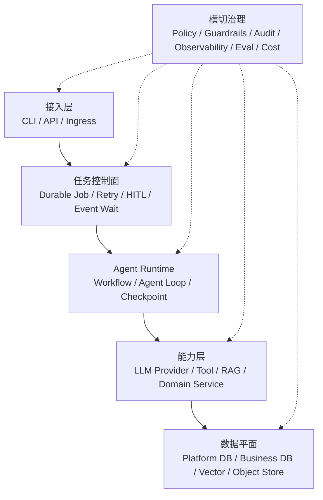

# Oria

Oria 是面向招商活动编排的 AI Agent 平台，把模型擅长的需求理解、检索、生成和排序，与确定性的业务规则、权限审批、幂等执行和审计证据分层实现。
它解决的不是一次性“让模型写个方案”，而是让 Agent 在可恢复、可复核、可对账的边界内参与真实业务流程。
目标链路覆盖「需求 → 规则快照 → 硬资格预筛 → LLM 软排序草案 → 审批 → 招商投放 → 报名/圈品 → 券关联 → 选品 → C 端投放 → 通知」。
Oria 用两个 Hero 场景说明何时该用固定流程、何时该让 Agent 动态探索：场景 A 是步骤预定、可中断恢复的招商 Workflow；场景 B 是路径随证据变化的运营归因 Agent。

- **场景 A：招商活动 Workflow**——规则快照、硬资格过滤、双审批、报名与圈品汇聚、异步选品、投放和通知按预定图执行。
- **场景 B：动态归因 Agent**——面对“华东餐饮招商转化率为什么下降”，Agent 根据中间证据决定下一步查漏斗、区域、活动还是历史经验。

## 总体架构



总体目标架构分为接入层、任务控制面、Agent Runtime、能力层和数据平面，并由权限、安全、审计、可观测、评测与成本治理横切约束；各层按版本逐步落地。

## 快速开始：5 分钟离线 Demo

前置条件：Python 3.11、uv 0.12.6。macOS Intel x86_64 与 Apple Silicon arm64 均受支持；CI 使用 `macos-14` arm64 job 验证 Apple Silicon 依赖与测试。

1. 按锁文件同步核心与开发依赖：

```bash
uv sync --locked --group dev
```

2. 运行只读提案 Demo：

```bash
uv run oria demo --output json
```

首次运行会在当前目录自动初始化 `.oria-data`，包括本地 SQLite、Checkpoint、Chroma 投影、合成规则和商家数据；不需要账号、API Key、网络或企业服务。重复执行是幂等的。

重点查看 JSON 中这些字段：

- `events[].tool`：实际出现 `search_campaign_rules` 与 `query_merchants` 两个只读 Tool；
- `proposal.rules`：基础信息、招商范围、报名/选品规则、优惠档位、确认规则、商家端素材六类规则及逐字段引用；
- `proposal.recommended_merchants`：经确定性硬资格过滤后的 10 家合格 Fixture 商家及排序理由；
- `run_id`、`correlation_id`：关联本次 Graph、日志和脱敏报告；
- `validation`：应包含 `rule_category_count=6`、`eligible_merchant_count=10`、`business_side_effect_free=true`；
- `report_path`：本次脱敏结果在 `.oria-data/reports-tmp/` 下的位置。

这个 Demo 会写初始化数据、Checkpoint、检索投影和报告，但没有业务副作用：不会创建 `Campaign`、`CouponBatch`，也不会调用招商、券、选品、C 端或 IM 企业系统。

## 当前提供的能力

| 版本 | 领域 | 当前交付 |
| --- | --- | --- |
| V0.1 | 只读招商提案 | 从需求生成带引用的规则快照，由 `EligibilityPolicy` 硬过滤商家，LLM 仅在候选集内软排序并生成零业务副作用的活动/券预览。 |
| V0.2 | Provider / RAG | 统一六家 Provider 的 Fixture 契约，提供授权 RAG、dense/BM25/rerank 三管线、60 条人工批准数据、冻结 holdout、Golden 与有预算的 Nightly；仅 DeepSeek 已 Live 验证。 |
| V0.3 | 完整 Workflow | 本地 SQLite + 官方 `AsyncSqliteSaver` + Mock 企业 Adapter 已跑通场景 A 的 10 步流程、双 HITL、外部事件等待、动态确认链、幂等账本和故障对账。 |
| V0.4 | 动态归因 Agent 起步 | 仅 T01 的可复现合成分析数据与根因标签物理隔离完成；查询 Tool、动态 Agent、冻结评测集与 Live 评测均未开始。 |

贯穿已交付能力的四条工程边界：

- **确定性优先**：硬资格由规则引擎执行，LLM 只处理候选集内软排序、草案和解释；
- **幂等执行**：业务唯一键、参数哈希和 execution ledger 共同约束重复执行；
- **HITL**：高风险招商发布与 C 端投放使用两道独立审批，审批绑定参数、Checkpoint 和策略版本；
- **故障对账**：外部结果不确定时进入 `unknown/reconciliation`，不盲目重投，也不伪回滚已发生事实。

### CLI 一览

| 命令 | 用途 |
| --- | --- |
| `oria demo` | 自动初始化并运行场景 A 的只读、带引用提案。 |
| `oria config` | 解析配置并输出不含密钥的诊断结果。 |
| `oria data` | 幂等迁移两套 SQLite 数据库并播种合成数据。 |
| `oria eval` | 运行版本化 RAG 评测；当前 suite 为 `rag`。 |
| `oria workflow` | 启动或恢复本地场景 A Checkpoint Workflow。 |
| `oria approval` | 批准或拒绝当前 Workflow 的 HITL 请求。 |
| `oria mock` | 注入经过本地受信边界处理的合成报名、关窗和选品事件。 |

完整命令树可随时查看：

```bash
uv run oria --help
```

## 如何接入和使用

### 安装与数据初始化

Demo 会自动初始化；需要先检查配置或为 Workflow 显式准备数据时，可运行：

```bash
uv run oria config doctor --output json
uv run oria data init --output json
```

`data init` 会按仓库 migration 幂等升级 Platform DB 与 Business DB、初始化官方 SQLite Saver，并播种合成数据。

### 跑完整本地 Workflow

以下命令展示完整业务流的 CLI 接法。后续命令中的 ID 来自前一步 JSON 的 `interrupts`；将示例变量值替换为实际返回值。

1. 启动 Workflow，直到第一次招商发布审批：

```bash
uv run oria workflow start --thread-id scenario-a-local-001 --campaign-id campaign-local-001 --request "生成华东餐饮招商活动并完成预定流程" --output json
```

2. 从输出复制 `approval_id`，批准 LaunchPlan：

```bash
APPROVAL_ID="粘贴实际的 approval_id"
uv run oria approval approve --thread-id scenario-a-local-001 --approval-id "$APPROVAL_ID" --output json
```

需要拒绝时使用 `approval reject`，并提供必填原因：

```bash
uv run oria approval reject --thread-id scenario-a-local-001 --approval-id "$APPROVAL_ID" --reason "草案需要调整" --output json
```

3. 注入一条 Mock 商家报名，再关闭报名窗口以恢复 Workflow：

```bash
uv run oria mock enrollment --thread-id scenario-a-local-001 --source-event-id enrollment-event-001 --merchant-id demo-m001 --product-ref synthetic-product-demo-m001 --output json
uv run oria mock window-close --thread-id scenario-a-local-001 --source-event-id window-close-event-001 --output json
```

4. 若返回 `business_confirmation`，复制当前 `confirmation_task_id` 并恢复；按返回的新任务重复，直到进入选品等待：

```bash
CONFIRMATION_TASK_ID="粘贴当前的 confirmation_task_id"
uv run oria workflow resume --thread-id scenario-a-local-001 --confirmation-task-id "$CONFIRMATION_TASK_ID" --decision confirm --output json
```

5. 注入选品决定与完成事件：

```bash
uv run oria mock selection-decision --thread-id scenario-a-local-001 --source-event-id selection-decision-event-001 --selection-version selection-v1 --decision selected --output json
uv run oria mock selection-complete --thread-id scenario-a-local-001 --source-event-id selection-complete-event-001 --selection-version selection-v1 --output json
```

6. 从输出复制第二个 `approval_id`，再次执行 `approval approve`，完成 C 端投放与商家通知。当前完整流程使用 Mock 企业 Adapter；这些命令不代表真实企业系统已经接入。

## 开发与验证

常用仓库命令：

```bash
make lint
make test
make build
make smoke
```

- `make lint`：检查 Ruff 格式、Ruff Lint 和 mypy；
- `make test`：运行不含 Live、Enterprise、Performance 的本地测试；
- `make build`：构建 wheel 与 sdist；
- `make smoke`：验证 `oria` CLI 入口。

运行场景 A Golden 与 RAG Golden：

```bash
uv run python scripts/run_scenario_a_golden.py
uv run python scripts/run_rag_golden.py
```

场景 A Golden 使用 30 条人工批准的离线样本；schema、安全、越权工具、引用回查及 critical case 必须 100% 通过，已登记指标不得低于同数据版本的冻结 baseline。Golden 使用 Mock/Fixture，不能替代真实模型质量验证。也可直接运行当前 RAG suite：

```bash
uv run oria eval run --suite rag --verification fixture --split all
```

Live/Enterprise 测试默认不运行；显式运行时必须提供开关、非空已知 target、凭证或组件与预算，不能把 skip 或 Mock 结果记为通过。

## 验证状态与声明边界

- **V0.3**：T01–T09 与 Core 已全部完成。T09 DeepSeek Live 卡已于 2026-09-03 通过，模型为 `deepseek-v4-flash`；报告见 [V0.3-T09 验证证据](reports/verification/v0.3/20260903T004622+0800/summary.md)。该卡只验证真实 DeepSeek 对本地合成规则和商家数据的草案/候选集内软排序，以及零业务副作用。
- **V0.4**：仅 T01 合成数据与标签隔离完成；T02–T05 的查询 Tool、动态归因 Agent、冻结集和 Live 评测均未开始。
- **Enterprise Adapter**：真实券、招商、商品库、选品、C 端投放和 IM 均未验证；当前 V0.3 完整流程使用 Mock Adapter 与合成数据。
- **多 worker / 企业栈**：SQLite Community 结果不证明 PostgreSQL 多 worker、企业网络、SSO、网关或生产 SLA。

验证结论始终分层：Fixture 证明确定性控制流与契约；Community 证明本地组件业务语义；Live 只证明指定日期、模型和配置下的公开模型调用；Enterprise 必须由每个真实 Adapter 独立出具证据。一个层级或目标通过，不能外推到另一个层级或目标。

## 文档

- [架构概览](ARCHITECTURE.md)
- [执行计划](ROADMAP.md)
- [V0.3 场景 A 威胁模型](docs/security/V0.3场景A威胁模型.md)
- [ADR 索引](docs/adr/README.md)
- [验证证据模板](reports/verification/TEMPLATE.md)

依赖必须通过 `uv.lock` 同步。仓库不提交密钥、令牌、真实客户数据或 `.env` 文件。
