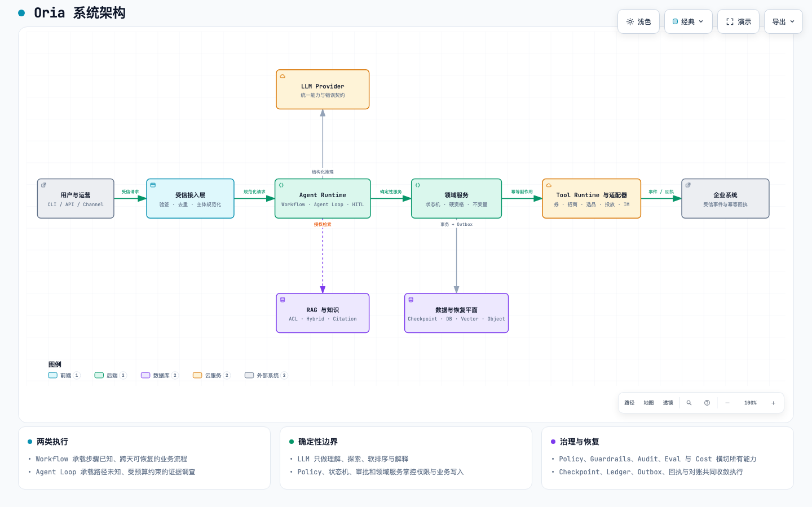

# Oria

Oria 是一个面向招商活动全生命周期的开源 AI Agent 工程。

一次完整的招商活动会跨越需求理解、规则检索、商家与商品筛选、活动和券方案、多人审批、报名圈品、招后选品、渠道投放与结果通知。这里既有适合大模型处理的非结构化信息和开放式分析，也有不能交给模型自由决定的资格规则、权限边界和业务副作用。Oria 的目标，是把两者放进同一套可执行、可恢复、可审计的系统：让 LLM 负责理解、探索和解释，让确定性 Policy、状态机、审批、幂等账本与证据校验掌控最终边界。

项目围绕两个互补场景展开：

- **场景 A · 招商活动编排**：从招商需求和规则快照出发，完成硬资格过滤、候选集内软排序、活动与券草案、双审批、报名/圈品汇聚、业务确认、异步选品、C 端投放和商家通知。
- **场景 B · 经营异常归因**：Agent 在受限的只读分析工具内自主选择调查路径，区分可归因、证据冲突和证据不足，并为结论保存可回查引用。

Oria 以 LangGraph 承载 Workflow 与有界 Agent 循环，以 SQLite/Checkpoint、RAG、Policy、HITL、execution ledger、outbox 和分层 Eval 组成当前工程骨架；整体架构预留多智能体、上下文与记忆治理、Durable Job、MCP、企业数据后端和可观测性扩展，同时保持 Community 环境可以使用合成数据与 Mock Adapter 独立运行。

## 在线场景导览

**[查看 Oria 在线场景导览](https://purebluefrank.github.io/oria/demo/)**

无需安装或 API Key，可按步骤浏览场景 A 的执行 Trace，并切换查看场景 B 的典型归因案例。这是基于版本化合成数据的场景导览，不是连接真实企业系统的在线 Sandbox；完整流程和执行边界见 [本地 Workflow 手册](docs/guides/local-workflow.md)。

## 60 秒本地体验

需要 Python 3.11 和 uv 0.12.6。同步锁定依赖后，运行零配置、无网络依赖的场景 A Demo：

```bash
uv sync --locked --group dev
uv run oria demo
```

Demo 会自动准备合成数据并生成带引用的招商提案，不会执行真实业务投放。想体验场景 B，运行 `uv run oria attribution ask`；参数与 Live 模式见 [场景 B 归因演示](docs/guides/attribution-demo.md)。

## 选择你的路径

| 路径 | 适合谁 | 依赖 | 入口 | 能证明什么 |
| --- | --- | --- | --- | --- |
| 零配置 Demo | 首次了解 Oria | 核心依赖，无 Key | `uv run oria demo` | Mock/Fixture 下的只读提案、引用和硬资格边界 |
| 完整本地 Workflow | 评估 10 步流程、HITL 和恢复 | 本地 SQLite、合成数据、Mock Adapter | [本地 Workflow 手册](docs/guides/local-workflow.md) | Community 业务语义、双审批/双等待与幂等对账 |
| 场景 B 归因演示 | 观察有界 ReAct 调查 | 默认无 Key；Live 需已配置模型 | `uv run oria attribution ask` | Mock 回放下的可执行证据链；Live 下才验证动态选路能力 |
| 真实 DeepSeek | 体验真实模型草案/软排序 | `standard` extra、DeepSeek Key、首次 BGE 下载 | [真实 LLM 快速开始](docs/guides/real-llm.md) | 指定 DeepSeek 模型与本地 BGE 的调用；不证明企业 Adapter |
| 开发验证 | 贡献者和架构评审者 | 开发依赖 | `make lint && make test` | 无 Live/Enterprise/Performance 的本地回归与静态门禁 |

## 架构概览

Oria 将执行编排、业务不变量和外部实现分层，并通过稳定契约组装模型、工具、存储与企业系统能力。

[](docs/diagrams/oria-system-architecture.html)

[打开 Archify 交互架构图](docs/diagrams/oria-system-architecture.html) · [查看可维护 JSON 图源](docs/diagrams/oria-system-architecture.architecture.json)

- **分层**：接入层只负责规范化请求；运行时管理 Workflow、Agent 循环、恢复与人工审批；领域层掌握状态机、硬资格和所有业务写入不变量。
- **插件化**：模型、Tool、存储和企业集成通过 `typing.Protocol` 与 Registry/Factory 组装，Runtime 启动后封存注册表，替换实现无需改写领域逻辑。
- **统一治理**：Policy、Guardrails、Audit 和 Eval 横切所有内建与扩展能力；受信扩展可走进程内插件，不受信扩展通过隔离的 MCP 边界接入。

更完整的分层、插件边界和数据不变量见 [架构概览](ARCHITECTURE.md)。

## 开发与文档导航

```bash
make lint
make test
make build
make smoke
```

`make test` 不运行 Live、Enterprise 和 Performance 标记。这些验证必须显式提供运行开关、非空已知 target 与所需凭证/组件，不能把 skip、Mock 或 Fixture 记为通过。

- 上手：[场景 B 归因演示](docs/guides/attribution-demo.md) · [真实 DeepSeek](docs/guides/real-llm.md) · [完整本地 Workflow](docs/guides/local-workflow.md)
- 参考：[数据模型与核心表](docs/reference/data-model.md) · [ADR 索引](docs/adr/README.md) · [威胁模型](docs/security/V0.3场景A威胁模型.md)
- 规划与证据：[执行计划](ROADMAP.md) · [统一验证证据索引](reports/verification/README.md) · [验证证据模板](reports/verification/TEMPLATE.md)

依赖必须通过 `uv.lock` 同步。仓库不提交密钥、令牌、真实客户数据或 `.env` 文件。
