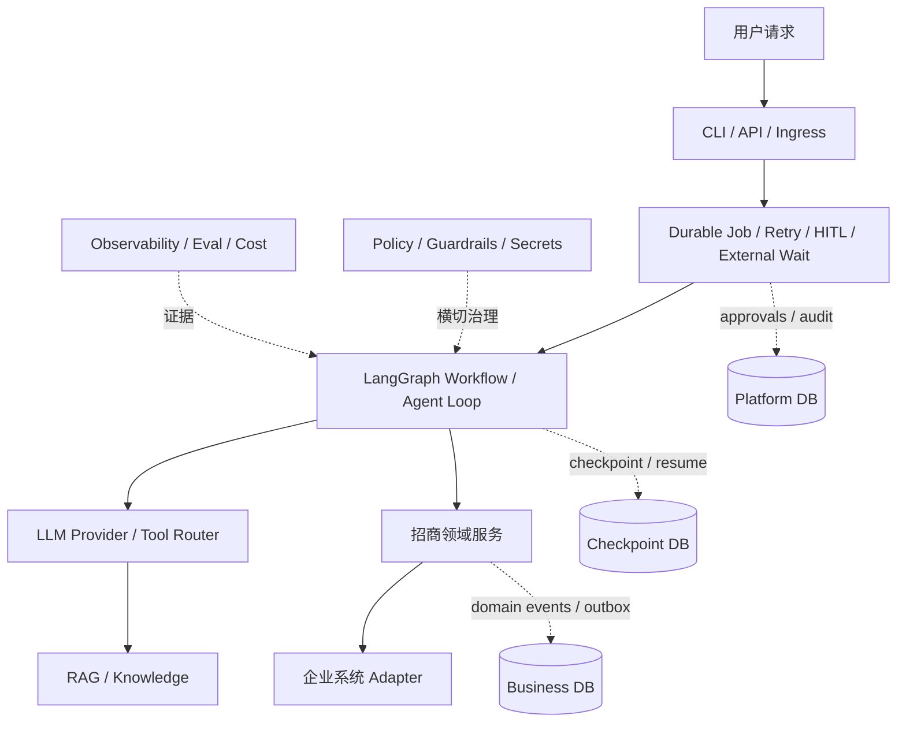

# Oria

Oria 是一个面向招商活动全生命周期的开源 AI Agent 工程。

一次完整的招商活动会跨越需求理解、规则检索、商家与商品筛选、活动和券方案、多人审批、报名圈品、招后选品、渠道投放与结果通知。这里既有适合大模型处理的非结构化信息和开放式分析，也有不能交给模型自由决定的资格规则、权限边界和业务副作用。Oria 的目标，是把两者放进同一套可执行、可恢复、可审计的系统：让 LLM 负责理解、探索和解释，让确定性 Policy、状态机、审批、幂等账本与证据校验掌控最终边界。

项目围绕两个互补场景展开：

- **场景 A · 招商活动编排**：从招商需求和规则快照出发，完成硬资格过滤、候选集内软排序、活动与券草案、双审批、报名/圈品汇聚、业务确认、异步选品、C 端投放和商家通知。
- **场景 B · 经营异常归因**：Agent 在受限的只读分析工具内自主选择调查路径，区分可归因、证据冲突和证据不足，并为结论保存可回查引用。

Oria 以 LangGraph 承载 Workflow 与有界 Agent 循环，以 SQLite/Checkpoint、RAG、Policy、HITL、execution ledger、outbox 和分层 Eval 组成当前工程骨架；整体架构预留多智能体、上下文与记忆治理、Durable Job、MCP、企业数据后端和可观测性扩展，同时保持 Community 环境可以使用合成数据与 Mock Adapter 独立运行。

## 在线演示

**[打开 Oria 交互 Demo](https://purebluefrank.github.io/oria/demo/)**

页面无需安装、账号或 API Key，直接展示场景 A 的十步冻结执行 Trace，以及场景 B 的归因、冲突、弃答和契约拦停案例。演示数据全部为版本化合成数据；企业系统由 Mock Adapter 模拟，不代表真实企业接入或生产效果。本地副本也可直接打开 [`docs/demo/index.html`](docs/demo/index.html)。

## 60 秒本地体验

需要 Python 3.11 和 uv 0.12.6。以锁文件同步依赖，再分别体验场景 A 的只读提案和场景 B 的动态归因演示：

```bash
uv sync --locked --group dev
uv run oria demo
uv run oria attribution ask
```

一次典型终端输出如下（ID 和路径每次不同）：

```text
$ uv sync --locked --group dev
Resolved 156 packages in <time>
Checked 121 packages in <time>
$ uv run oria demo
Oria offline demo completed
Correlation: corr_<generated>
Eligible merchants: 10
Proposal report: <data-dir>/reports-tmp/run_<generated>.json
```

`demo` 会自动迁移本地 SQLite、播种 12 家合成商家、建立 Chroma 投影，再运行带逐字段引用的招商提案。`attribution ask` 默认回放已审阅的 development 案例 `sb-v1-001`，通过真实有界归因 Graph 逐步查询漏斗、活动与大盘证据，并解释每一步为何继续。两个入口默认都不需要账号、Key、网络或企业服务，也不会执行任何业务投放。

`attribution ask` 是场景 B 的演示入口，不是冻结评测入口。可用 `--case-id` 精确选择 development 案例，或传入与已审阅案例规范化后完全一致的自由问题；未知问题、未知 case 和 holdout 都会拒绝执行。传入 `--llm-profile <已配置的非 Mock profile>` 后切换 Live，使用同一 Graph、Runtime 和只读工具验证真实模型的动态工具选择与归因能力；这会发生真实网络调用，结果不等于质量门禁通过。详见[场景 B 归因演示](docs/guides/attribution-demo.md)。

## 选择你的路径

| 路径 | 适合谁 | 依赖 | 入口 | 能证明什么 |
| --- | --- | --- | --- | --- |
| 零配置 Demo | 首次了解 Oria | 核心依赖，无 Key | `uv run oria demo` | Mock/Fixture 下的只读提案、引用和硬资格边界 |
| 场景 B 归因演示 | 观察有界 ReAct 调查 | 默认无 Key；Live 需已配置模型 | `uv run oria attribution ask` | Mock 回放下的可执行证据链；Live 下才验证动态选路能力 |
| 真实 DeepSeek | 体验真实模型草案/软排序 | `standard` extra、DeepSeek Key、首次 BGE 下载 | [真实 LLM 快速开始](docs/guides/real-llm.md) | 指定 DeepSeek 模型与本地 BGE 的调用；不证明企业 Adapter |
| 完整本地 Workflow | 评估 10 步流程、HITL 和恢复 | 本地 SQLite、合成数据、Mock Adapter | [本地 Workflow 手册](docs/guides/local-workflow.md) | Community 业务语义、双审批/双等待与幂等对账 |
| 开发验证 | 贡献者和架构评审者 | 开发依赖 | `make lint && make test` | 无 Live/Enterprise/Performance 的本地回归与静态门禁 |

## Workflow 十步概览

| 步骤 | Oria 做什么 | 何时需要人 | 产物 |
| --- | --- | --- | --- |
| 1. 需求受理 | 规范化请求并校验本地可信主体 | 输入招商目标 | `CampaignIntent` |
| 2. 规则快照 | 检索六类规则并固化逐字段引用 | 规则缺失或冲突时澄清 | `CampaignRuleSnapshot` |
| 3. 商家预筛 | 用 `EligibilityPolicy` 执行确定性硬资格过滤 | 通常不需要 | 合格候选集与排除摘要 |
| 4. 软排序与草案 | LLM 仅在合格候选集内排序、解释并生成草案 | 未决项需补充 | 活动/券草案与商家排序 |
| 5. 招商投放 | 绑定 LaunchPlan，幂等物化券并投放商家侧 | 运营审批 `launch_approval` | 券批次回执与招商投放回执 |
| 6. 报名/圈品汇聚 | 合并商家报名与系统圈品，等待关窗 | 商家发起报名 | 去重的 `EnrollmentItem` |
| 7. 业务确认与券关联 | 按冻结规则运行动态确认链，再关联券批次 | 内置 Fixture 需商家→销售→经理三级确认 | `ConfirmationTask` 与券关联 |
| 8. 异步选品 | 提交选品并等待受信结果事件 | 外部系统返回结果 | `AssortmentSubmission` / `SelectionDecision` |
| 9. C 端投放 | 只纳入已入选且券关联有效的商品 | 审批 `consumer_publish_approval` | `ConsumerPlacement` 与回执 |
| 10. 通知闭环 | 按商家发送结果，失败进重试/死信 | 非标准或敏感通知时升级 | 通知回执、审计与对账证据 |

完整本地样例会先停在 Launch 审批，经报名关窗、3 轮业务确认和选品事件后，再停在 C 端投放审批；终态为 `status: completed` 且 `interrupts: []`。所有命令、ID 来源和拒绝分支见 [本地 Workflow 操作手册](docs/guides/local-workflow.md)。

## 架构与关键约束



- Checkpoint 记录“执行到哪里”，Domain/Audit Event 记录“发生了什么”，二者不互相代替。
- 硬资格由确定性 Policy 判定；LLM 不能放宽规则、直接写库或选择审批人。
- 招商投放与 C 端投放是两个独立副作用和两道独立 HITL。
- 副作用用参数哈希、业务幂等键、execution ledger、outbox 和对账收敛。
- 读写都绑定 tenant、actor/executor 与 PolicyDecision，RAG 在召回前强制 ACL 过滤。
- 合成数据、Fixture、Community、Live 和 Enterprise 证据分层记录，Mock 结果不会冒充真实接入。

更完整的分层和数据边界见 [架构概览](ARCHITECTURE.md) 与 [Oria 架构设计](Oria架构设计.md)。

## 验证状态与限制

- V0.3 T01–T09 已完成；T09 DeepSeek Live 卡于 2026-09-03 通过，证据见 [V0.3-T09 验证报告](reports/verification/v0.3/20260903T004622+0800/summary.md)。
- 该 Live 卡只验证 `deepseek-v4-flash` 对本地合成规则/商家数据的草案和候选集内软排序；Kimi、智谱、OpenAI API 和 Anthropic 尚无通过的正式 Live 卡。场景 B 的 Codex/ChatGPT 订阅验证是独立通道，不等同于 OpenAI API 验证。
- 完整场景 A 已通过本地 SQLite、AsyncSqliteSaver、合成数据和 Mock Adapter 验证；真实券、招商、商品库、选品、C 端投放和 IM 未验证。
- SQLite Community 结果不证明 PostgreSQL 多 worker、企业网络、SSO、网关或生产 SLA。V0.4 T01–T04 已完成；T04 的 50 条案例包含 20 条可回答、24 条证据/权限不足、6 条冲突证据和 6 条真实会话历史案例，保留并冻结 30/20 split。8 条非空根因标签仅用于受控合成变体的有限归因；[Golden 全文](eval/datasets/scenario_b/CASES.md)已由 `FrankLee` 审阅并创建 Fixture baseline。T05 已在 DeepSeek `deepseek-v4-flash` 上完成 20×3 冻结 Holdout：60/60 完整执行但自动通过仅 7/60，`FrankLee` 已确认 10 条盲评均失败，真实模型质量卡以 failed 收口；[Live 证据](reports/verification/v0.4/20260906T104603+0800/summary.md)如实保留逐例结果、方差、coverage-risk、成本和失败分布。
- `deepseek-pro-structured` 修复候选在 development 上完成 attributed 2/2、insufficient 2/2、conflicting 3/6 的干净通过，其余 3 次按因果/工具契约 fail closed；最终本地回归 813 passed。`FrankLee` 复评 4 个代表项通过，但该复评不是严格盲评，候选仍未晋升默认，详见[修复记录](reports/verification/v0.4/20260906-remediation/分析与修复.md)。
- `codex-subscription-gpt56-sol-high` 已在冻结 V2 holdout 上完成 60/60，自动通过率 91.67%，严格人工盲评 10/10 达线、平均 0.98，现为场景 B 推荐 Live target。Live runner 仍要求显式选择；V2 保持冻结且不启动 V3，详见[第 4 轮报告](reports/verification/v0.4/20260909-gpt56-sol-round4/README.md)。

## 开发与文档导航

```bash
make lint
make test
make build
make smoke
```

`make test` 不运行 Live、Enterprise 和 Performance 标记。这些验证必须显式提供运行开关、非空已知 target 与所需凭证/组件，不能把 skip、Mock 或 Fixture 记为通过。

- 上手：[场景 B 归因演示](docs/guides/attribution-demo.md) · [真实 DeepSeek](docs/guides/real-llm.md) · [完整本地 Workflow](docs/guides/local-workflow.md)
- 参考：[数据模型与核心表](docs/reference/data-model.md) · [ADR 索引](docs/adr/README.md) · [威胁模型](docs/security/V0.3场景A威胁模型.md)
- 规划与证据：[详细执行路线](docs/Oria详细执行路线.md) · [执行计划](ROADMAP.md) · [统一验证证据索引](reports/verification/README.md) · [验证证据模板](reports/verification/TEMPLATE.md)

依赖必须通过 `uv.lock` 同步。仓库不提交密钥、令牌、真实客户数据或 `.env` 文件。
