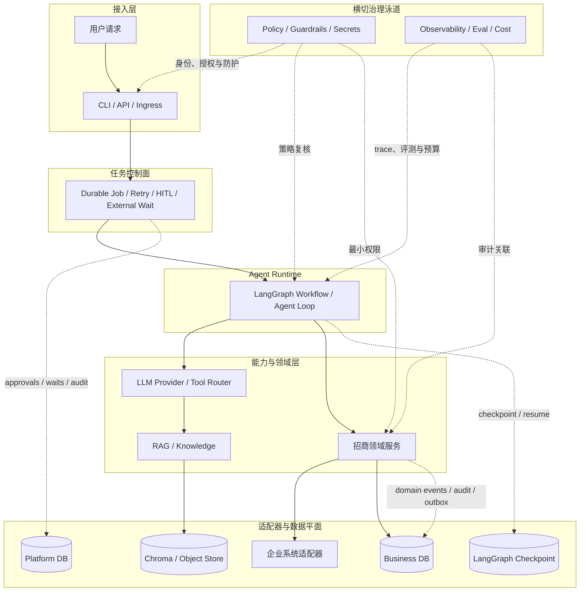

# Oria

Oria 是面向招商活动编排的 AI Agent 平台。它把模型擅长的需求理解、检索、生成和排序，与确定性的业务规则、权限审批、幂等执行和审计证据分层实现，让 Agent 能在可恢复、可复核、可对账的边界内参与真实业务流程。

当前主场景是步骤预定、可中断恢复的招商 Workflow：需求 → 规则快照 → 商家预筛与软排序 → 活动/券草案 → 招商投放 → 报名/圈品 → 确认链 → 选品 → C 端投放 → 商家通知。动态归因 Agent 是另一条演进主线，目前只完成 V0.4 T01 的合成分析数据与标签隔离。

## 总体架构

下图与 [ARCHITECTURE.md](ARCHITECTURE.md) 使用同一分层和数据边界。实线是主业务/调用链，虚线是恢复、审计与治理旁路；Checkpoint 记录“执行到哪里”，Domain/Audit Event 记录“发生了什么”，二者不互相替代。



总体目标架构依次分为接入层、任务控制面、Agent Runtime、能力与领域层、适配器与数据平面；权限、安全、审计、可观测、评测与成本治理横切各层。流程已知、跨天且需要恢复时使用 Workflow；探索路径取决于中间证据时使用 Agent loop；两者共享 Checkpoint、工具协议和治理能力。

## 当前提供的能力

| 功能 | 做了什么与关键保障 |
| --- | --- |
| 知识检索 | 生成不可变规则快照，覆盖基础信息、招商范围、报名规则、优惠档位、确认规则和商家端素材六类字段及逐字段引用；授权 RAG 提供 dense、dense+BM25、dense+BM25+rerank 三条可验证管线。 |
| 资格与排序 | `EligibilityPolicy` 和 `ProductEligibilityPolicy` 确定性执行商家/商品硬资格预筛；LLM 只能在已授权候选集内做软排序、草案和解释，不能放宽硬规则。 |
| 活动编排 | 持久化活动与券批次草案，分别执行券物化和商家侧招商投放；Launch 与 C 端发布使用两道独立 HITL，审批绑定参数、Checkpoint 和策略版本。 |
| 报名与选品 | 汇聚商家自主报名与系统自动圈品，按冻结规则执行零到多级动态确认链，完成券关联后异步提交选品并等待受信事件恢复。 |
| 投放与通知 | 只把已入选且券关联有效的商品投放到 C 端，再按商家保存通知回执；通知失败进入重试或死信，不回滚已完成投放。 |
| 可靠性与治理 | 业务唯一键、参数哈希和 execution ledger 保证幂等；外部结果不确定时进入对账，审计按库落盘并脱敏，所有读写遵循 tenant、RBAC 和最小权限。 |

版本进度：V0.3 T01–T09 完成，完整场景 A 已通过 Community/Fixture 验证，DeepSeek Live 卡只验证草案与候选集内软排序；V0.4 仅 T01 完成，动态归因 Agent 尚未实现。

## 快速开始

### 1. 前置条件与安装

需要 Python 3.11 和 uv 0.12.6。按锁文件同步核心与开发依赖：

```bash
uv sync --locked --group dev
```

### 2. 5 分钟跑通 Demo

```bash
uv run oria demo --output json
```

`demo` 把两个动作合在一次命令里：先自动初始化本地数据，再运行一次带引用、零业务副作用的只读招商提案。它不需要账号、API Key、网络或企业服务，也不会创建 Campaign/CouponBatch 或调用真实券、招商、选品、C 端、IM 系统。

完整过程如下：

1. 校验内置合成资产，幂等迁移 Platform DB 与 Business DB，播种商家，并初始化官方 LangGraph SQLite Saver。
2. 摄取合成招商规则，保存本地对象并建立 Chroma 向量投影。
3. 运行 `search_campaign_rules`，取得六类结构化规则及逐字段 `document/version/chunk` 引用。
4. 运行 `query_merchants`，由确定性硬资格规则从 12 家 Fixture 商家中保留 10 家、排除 2 家。
5. 让 Mock LLM 仅在合格候选集内生成活动/券预览、商家排序与理由，校验零业务副作用后写入脱敏报告。

重点查看 JSON 的 `events[].tool`、`proposal.rules`、`proposal.field_evidence`、`proposal.recommended_merchants`、`validation`、`run_id`、`correlation_id` 和 `report_path`。正常结果包含 `rule_category_count=6`、`eligible_merchant_count=10`、`business_side_effect_free=true`。

### 3. Demo 初始化了什么

- 合成招商规则：基础信息、招商范围、报名规则、优惠档位、确认规则、商家端素材六类；每个叶子字段都有可回查引用。
- 合成商家：12 家 Fixture；10 家通过类目、城市、名单、报名系统、销售组织和启用状态等硬资格，2 家被排除。
- 两套 SQLite：`.oria-data/sqlite/platform.db` 保存知识目录、审批、外部等待、集成事件、平台审计及官方 Checkpoint 表；`.oria-data/sqlite/business.db` 保存商家和招商领域事实。
- 本地投影与证据：`.oria-data/chroma/` 是可重建向量投影，`.oria-data/objects/` 保存规则对象，`.oria-data/reports-tmp/` 保存脱敏 Demo 报告。

以下只列最关键的 13 组表；表名已按 `src/oria/migrations/runner.py` 的 `_EXPECTED_COLUMNS` 及 Platform/Business migration 核对：

| 数据库与表名 | 用途 |
| --- | --- |
| Business `campaigns` | 保存活动及其规则快照引用、报名模式和状态。 |
| Business `coupon_batches` | 保存活动券批次、券规格哈希和物化状态。 |
| Business `enrollment_items` | 以业务唯一键汇聚自主报名与自动圈品的商品。 |
| Business `confirmation_tasks` | 保存 merchant → sales → sales_manager 动态确认步骤及状态。 |
| Business `assortment_submissions` / `selection_decisions` | 分别保存异步选品提交和逐商品选品决定。 |
| Business `consumer_placements` | 保存最终 C 端投放请求、状态和回执。 |
| Business `merchant_notifications` | 保存商家通知状态、尝试次数和送达回执。 |
| Business `tool_executions` | 作为副作用 execution ledger，记录幂等键、参数哈希、状态与回执。 |
| Business `domain_events` | 追加保存可回放、可对账的业务事实。 |
| Platform `approvals` | 保存两道 HITL 的绑定、决定、主体和有效期。 |
| Platform `external_waits` | 保存报名关窗、选品结果等外部等待及恢复绑定。 |
| Platform `integration_event_inbox` | 对受信外部事件验签后去重、脱敏并匹配等待。 |
| 两库 `audit_events` / `outbox` | 分库保存安全审计与待投递事件，避免伪造跨库事务。 |

### 4. `demo` 与 `data init` 怎么选

`demo` 内部已经调用初始化，所以第一次体验不需要先执行 `data init`。`data init` 是同一初始化步骤的显式、可单独执行入口：只想建库/升级 migration/播种 Fixture，或为后续 workflow 提前准备数据时使用它；重复执行幂等，已存在的商家不会重复插入。

```bash
# 初始化 + 立即运行一次只读提案
uv run oria demo --output json

# 只初始化，不运行提案
uv run oria data init --output json
```

### 5. 跑完整本地 Workflow

下面从显式初始化递进到完整业务流程。所有 ID 都从上一条命令返回的 `interrupts[0]` 复制；同一次流程必须复用相同的 `DATA_DIR` 和 `THREAD_ID`。

```bash
DATA_DIR="/tmp/oria-workflow-local"
THREAD_ID="scenario-a-local-001"
CAMPAIGN_ID="campaign-local-001"
uv run oria data init --data-dir "$DATA_DIR" --output json
uv run oria workflow start \
  --data-dir "$DATA_DIR" \
  --thread-id "$THREAD_ID" \
  --campaign-id "$CAMPAIGN_ID" \
  --request "生成华东餐饮招商活动并完成预定流程" \
  --output json
```

启动结果的 `kind` 是 `launch_approval`。复制同一对象的 `approval_id`，批准 LaunchPlan：

```bash
LAUNCH_APPROVAL_ID="粘贴 interrupts[0].approval_id"
uv run oria approval approve \
  --data-dir "$DATA_DIR" \
  --thread-id "$THREAD_ID" \
  --approval-id "$LAUNCH_APPROVAL_ID" \
  --output json
```

批准后进入 `kind: enrollment_window`。注入一条商家报名，再关闭窗口；`enrollment` 只接收事件，`window-close` 才恢复 Workflow：

```bash
uv run oria mock enrollment \
  --data-dir "$DATA_DIR" --thread-id "$THREAD_ID" \
  --source-event-id enrollment-event-001 \
  --merchant-id demo-m001 \
  --product-ref synthetic-product-demo-m001 \
  --output json
uv run oria mock window-close \
  --data-dir "$DATA_DIR" --thread-id "$THREAD_ID" \
  --source-event-id window-close-event-001 \
  --output json
```

窗口关闭后进入动态业务确认链。`interrupts[0]` 的实际结构包含 `kind: business_confirmation`、`confirmation_task_id` 和 `interrupt_id`。每次 `workflow resume` **只确认一个任务**：从最新返回重新复制 `confirmation_task_id`，循环执行下面命令；只要返回的 `kind` 仍是 `business_confirmation` 就继续，变成 `selection_event` 才停止。

```bash
CONFIRMATION_TASK_ID="粘贴最新 interrupts[0].confirmation_task_id"
uv run oria workflow resume \
  --data-dir "$DATA_DIR" \
  --thread-id "$THREAD_ID" \
  --confirmation-task-id "$CONFIRMATION_TASK_ID" \
  --decision confirm \
  --output json
```

当前内置 Fixture 的冻结规则是 merchant → sales → sales_manager，共 **3 级，因此要执行 3 轮 resume**。确认链由规则动态生成，不能把“一次 resume 后直接选品”当成通用行为。第三轮实测返回 `kind: selection_event` 和 `wait_id`，表示已经自动完成券关联、提交选品并进入异步选品等待。

先注入逐商品选品决定；此命令不会恢复 Graph，返回仍是 `selection_event`。再注入完成事件，才会恢复并返回第二个 `kind: consumer_publish_approval`：

```bash
uv run oria mock selection-decision \
  --data-dir "$DATA_DIR" --thread-id "$THREAD_ID" \
  --source-event-id selection-decision-event-001 \
  --selection-version selection-v1 \
  --decision selected \
  --output json
uv run oria mock selection-complete \
  --data-dir "$DATA_DIR" --thread-id "$THREAD_ID" \
  --source-event-id selection-complete-event-001 \
  --selection-version selection-v1 \
  --output json
```

复制这次返回的 `approval_id`，用同一个 `approval approve` 命令批准 C 端投放：

```bash
CONSUMER_APPROVAL_ID="粘贴 interrupts[0].approval_id"
uv run oria approval approve \
  --data-dir "$DATA_DIR" \
  --thread-id "$THREAD_ID" \
  --approval-id "$CONSUMER_APPROVAL_ID" \
  --output json
```

成功终态是 `status: completed` 且 `interrupts: []`；随后 Business DB 中投放为 `published`、商家通知为 `sent`。完整流程使用本地 SQLite、合成数据和 Mock 企业 Adapter，不代表真实企业系统已接入。

## 开发与验证

```bash
make lint
make test
make build
make smoke
```

`make lint` 运行 Ruff 格式/Lint 与 mypy；`make test` 运行不含 Live、Enterprise、Performance 的本地测试；`make build` 构建 wheel/sdist；`make smoke` 验证 CLI 入口。场景 A 与 RAG Golden 可分别运行：

```bash
uv run python scripts/run_scenario_a_golden.py
uv run python scripts/run_rag_golden.py
uv run oria eval run --suite rag --verification fixture --split all
```

Live/Enterprise 测试默认不运行；显式运行时必须提供开关、非空已知 target、凭证或组件与预算，不能把 skip、Mock 或 Fixture 结果记为通过。

## 验证状态与声明边界

- **V0.3**：T01–T09 与 Core 已完成。T09 DeepSeek Live 卡已于 2026-09-03 通过，模型为 `deepseek-v4-flash`；证据见 [V0.3-T09 验证报告](reports/verification/v0.3/20260903T004622+0800/summary.md)。该卡只验证真实 DeepSeek 对本地合成规则和商家数据的草案/候选集内软排序，以及零业务副作用。
- **V0.4**：仅 T01 合成数据与标签隔离完成；查询 Tool、动态归因 Agent、冻结评测集与 Live 评测均未开始。
- **Enterprise Adapter**：真实券、招商、商品库、选品、C 端投放和 IM 均未验证；V0.3 完整流程使用 Mock Adapter 与合成数据。
- **多 worker / 企业栈**：SQLite Community 结果不证明 PostgreSQL 多 worker、企业网络、SSO、网关或生产 SLA。

验证结论始终分层：Fixture 证明确定性控制流与契约；Community 证明本地组件业务语义；Live 只证明指定日期、模型和配置下的公开模型调用；Enterprise 必须由每个真实 Adapter 独立出具证据。

## 文档

- [架构概览](ARCHITECTURE.md)
- [执行计划](ROADMAP.md)
- [详细执行路线](docs/Oria详细执行路线.md)
- [V0.3 场景 A 威胁模型](docs/security/V0.3场景A威胁模型.md)
- [ADR 索引](docs/adr/README.md)
- [验证证据模板](reports/verification/TEMPLATE.md)

依赖必须通过 `uv.lock` 同步。仓库不提交密钥、令牌、真实客户数据或 `.env` 文件。
